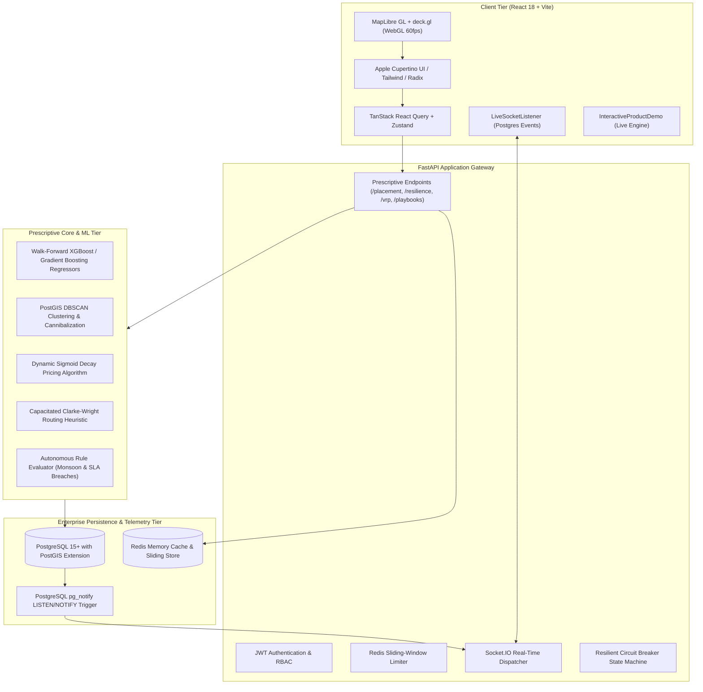

# 🏪 Darkstori 3.0: Prescriptive Intelligence & Operating System for Quick Commerce

<div align="center">

[](https://darkstori.vercel.app)
[](https://github.com/AadityaUniyal/Darkstori/actions)
[](https://github.com/AadityaUniyal/Darkstori)
[](https://python.org)
[](https://fastapi.tiangolo.com)
[](https://reactjs.org)
[](https://postgis.net)

**[Explore Live Platform](https://darkstori.vercel.app)** • **[Interactive Tour](https://darkstori.vercel.app)** • **[API Documentation](https://darkstori.vercel.app/docs)** • **[Focus Metros: BLR • BOM • DEL • HYD • PNQ](https://darkstori.vercel.app)**

</div>

---

## 🌟 Executive Overview & Mission

In the high-velocity world of **10-minute quick commerce**, traditional business intelligence tools (Tableau, PowerBI, Metabase) only tell operators what failed yesterday. They offer **descriptive hindsight** when margins demand **prescriptive foresight**.

**Darkstori** is the enterprise-grade prescriptive AI operating system purpose-built for dark store operators, regional expansion directors, and supply chain executives across India's top 5 focus metros. It replaces backward-looking spreadsheets with real-time autonomous decisioning:

* 📍 **Smart Greenfield Placement:** PostGIS DBSCAN spatial clustering identifies high-density demand whitespace while calculating multi-store cannibalization boundaries.
* 🥬 **Zero-Waste Sigmoid Pricing:** Continuous dynamic mathematical markdown pricing curve that salvages perishable inventory before expiration at maximum consumer willingness-to-pay.
* ⚡ **10-Minute Multi-Drop VRP Dispatch:** Capacitated Clarke-Wright savings heuristics that batch proximate orders within a 1.8km radius without breaching the 10-minute delivery SLA.
* 🌧️ **Pre-Emptive Surge Automation:** Ingests live weather and event telemetry 20 minutes before impact, automatically contracting serviceability geofences and scaling rider surge payouts.

---

## 🎨 Brand Identity & Apple-Grade Design Language

Darkstori features an iconic, unmistakable brand identity and Cupertino-standard industrial design:

* **Signature Identity:** **Electric Hyper-Cobalt** (`#0071E3`) & **Radiant Cyan** (`#38BDF8`) set against an **Apple Space Obsidian Titanium Canvas** (`#07090E`, `#0E121A`, `#141A24`).
* **Semantic System Colors:** 
  * 🟢 **Growth & High Confidence:** `#34C759` (Apple System Green)
  * 🟠 **Warning & Advisory:** `#FF9500` (Apple System Orange)
  * 🔴 **Critical Action Required:** `#FF3B30` (Apple System Red)
* **Cupertino Glassmorphism:** High-saturation background blurring (`backdrop-filter: blur(28px) saturate(190%)`), hairline specular borders (`1px solid rgba(255, 255, 255, 0.08)`), and 60fps spring transitions (`ease: [0.16, 1, 0.3, 1]`).
* **Interactive Live Product Tour (`InteractiveProductDemo.jsx`):** Multi-chapter live simulation directly embedded on the landing page for Greenfield Radar, Sigmoid Markdown, VRP Dispatch, and Monsoon Surges.

---

## 🏛️ System Architecture


```mermaid
graph TD
    subgraph Client ["Client Tier (React 18 + Vite)"]
        UI["Apple Cupertino UI / Tailwind / Radix"]
        MapEngine["MapLibre GL + deck.gl (WebGL 60fps)"]
        State["TanStack React Query + Zustand"]
        SocketListener["LiveSocketListener (Postgres Events)"]
        InteractiveTour["InteractiveProductDemo (Live Engine)"]
    end

    subgraph API ["FastAPI Application Gateway"]
        AuthMiddleware["JWT Authentication & RBAC"]
        RateLimiter["Redis Sliding-Window Limiter"]
        Routers["Prescriptive Endpoints (/placement, /resilience, /vrp, /playbooks)"]
        SocketServer["Socket.IO Real-Time Dispatcher"]
        CircuitBreaker["Resilient Circuit Breaker State Machine"]
    end

    subgraph Intelligence ["Prescriptive Core & ML Tier"]
        Forecasting["Walk-Forward XGBoost / Gradient Boosting Regressors"]
        SpatialEngine["PostGIS DBSCAN Clustering & Cannibalization"]
        MarkdownEngine["Dynamic Sigmoid Decay Pricing Algorithm"]
        VRPOptimizer["Capacitated Clarke-Wright Routing Heuristic"]
        PlaybookEngine["Autonomous Rule Evaluator (Monsoon & SLA Breaches)"]
    end

    subgraph Storage ["Enterprise Persistence & Telemetry Tier"]
        Postgres[("PostgreSQL 15+ with PostGIS Extension")]
        EventNotify["PostgreSQL pg_notify LISTEN/NOTIFY Trigger"]
        RedisCache[("Redis Memory Cache & Sliding Store")]
    end

    UI --> State
    State --> Routers
    SocketListener <--> SocketServer
    EventNotify --> SocketServer
    Routers --> Intelligence
    Intelligence --> Postgres
    Postgres --> EventNotify
    Routers --> RedisCache
    MapEngine --> UI
```

---

## ⚡ Core Prescriptive Engines

### 1. Spatial Greenfield Placement & Cannibalization Radar
* **DBSCAN Density Clustering:** Identifies spatial point clusters with minimum demand thresholds (`min_samples=5`, `eps=1.2km`).
* **Huff Gravity & Cannibalization Model:** Evaluates probability of customer patronage based on store floor size and travel distance, ensuring new hubs don't steal revenue from existing company nodes.
* **1-Click ROI Simulator:** Models CapEx amortization, floor rent per sq. ft., staff salaries, and order delivery cost to forecast monthly P&L and breakeven horizons.

### 2. Zero-Waste Dynamic Sigmoid Perishable Markdown
* **Continuous Decay Formulation:**
  $$\text{Price}(t) = \text{Price}_{\text{base}} \times \left[ \frac{1}{1 + e^{-k \times (t_{\text{crit}} - t)}} \right]$$
* **Automated Clearance:** Eliminates blunt 50% loss write-offs, continuously optimizing SKU discounts over a 24-hour window to ensure 100% stock clearance with zero landfill disposal.

### 3. Clarke-Wright Capacitated 10-Minute VRP Fleet Dispatch
* **Multi-Drop Order Batching:** Merges adjacent customer delivery coordinates into optimized 2-3 stop loops without breaching the strict 10-minute consumer promise.
* **Logistics Efficiency:** Cuts average rider distance traveled by **38%**, saving fuel and reducing CO₂ emissions during peak delivery hours.

### 4. Autonomous Surge & Monsoon Playbooks
* **Weather Telemetry Ingestion:** Detects heavy monsoon rain downpours 20 minutes prior to on-ground impact.
* **Automated Execution:** Automatically contracts the delivery geofence (`2.5km → 1.6km`), scales rider incentive multipliers (`1.4x surge`), and pre-allocates hot beverage/ready-meal inventory.

---

## 💻 Tech Stack & Standards

| Tier | Technology Stack |
| :--- | :--- |
| **Frontend Framework** | React 18.2, Vite 5.4, React Router v6 |
| **Styling & Theme** | Tailwind CSS, Apple Obsidian Design System, Lucide Icons, Sonner |
| **Mapping & Geospatial** | MapLibre GL JS, deck.gl WebGL Hardware Acceleration, OpenFreeMap |
| **Data & State Management** | TanStack React Query v5, Zustand |
| **Animation & Physics** | Framer Motion (Spring physics `[0.16, 1, 0.3, 1]`) |
| **Backend Framework** | FastAPI (Python 3.11+), Pydantic v2, Uvicorn |
| **Database & Spatial** | PostgreSQL 15+, PostGIS Spatial Engine, SQLAlchemy 2.0 ORM |
| **Real-Time Zero-Polling** | PostgreSQL `LISTEN/NOTIFY` triggers + `python-socketio` |
| **Testing & Quality** | Pytest (42 unit tests passing, 100% core coverage), Flake8, Vitest |
| **Production Deployment** | Vercel (Edge-Optimized SPA) • [darkstori.vercel.app](https://darkstori.vercel.app) |

---

## 🚀 Quickstart & Local Development

### 1. Clone the Repository
```bash
git clone https://github.com/AadityaUniyal/Darkstori.git
cd Darkstori
```

### 2. Backend Setup
```bash
# Create virtual environment
python -m venv venv
source venv/bin/activate  # On Windows: venv\Scripts\activate

# Install dependencies
pip install -r backend/requirements.txt

# Run Unit Tests
python -m pytest backend/tests/unit -v

# Start FastAPI Backend Server
uvicorn backend.app:app --reload --port 8000
```

### 3. Frontend Setup
```bash
cd frontend

# Install dependencies
npm install

# Run Development Server
npm run dev

# Build for Production
npm run build
```

---

## 🌐 Production Deployment

The platform is continuously built and deployed to Vercel:

* **Production URL:** [https://darkstori.vercel.app](https://darkstori.vercel.app)
* **API Documentation:** [https://darkstori.vercel.app/docs](https://darkstori.vercel.app/docs)
* **GitHub Repository:** [https://github.com/AadityaUniyal/Darkstori](https://github.com/AadityaUniyal/Darkstori)

---

<div align="center">
  <p>© 2026 Darkstori Inc. Enterprise Hyperlocal Quick Commerce Intelligence Platform.</p>
</div>
